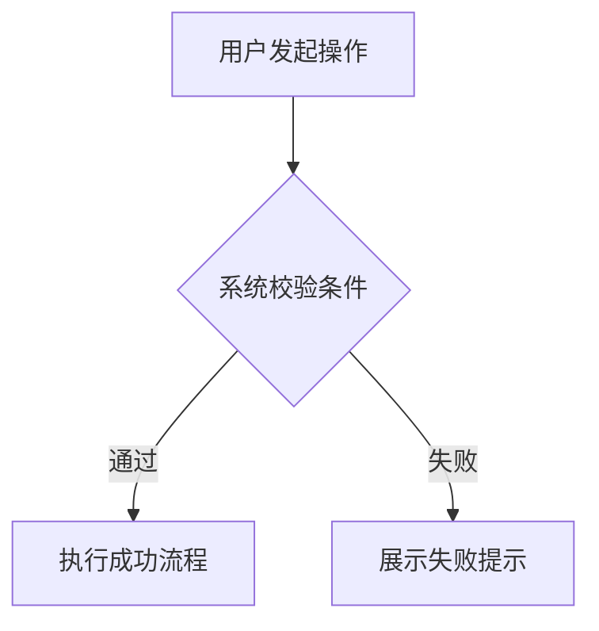
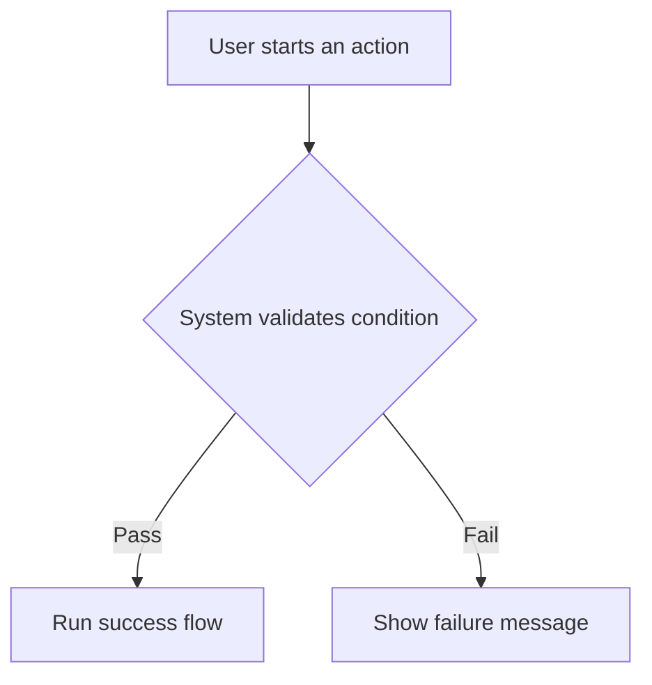

# Structured PRD Writer

中文 | [English](#english)

## 中文

Structured PRD Writer 是一个用于撰写、整理和审查结构化产品需求文档的 Codex Skill。

它适合产品经理、业务分析师、实施顾问、交付团队和需要把 BRD、SOW、会议纪要、项目需求或零散想法整理成正式 PRD 的人使用。

这个 Skill 的重点不是“写一篇看起来很完整的文档”，而是帮助你生成一份 **结构完整、范围清晰、可评审、可交付、方便研发理解** 的 PRD。

### 它能帮你做什么

- 根据 BRD、SOW、需求说明、会议记录或口头描述生成标准 PRD。
- 把已有 PRD 按统一结构重新整理和标准化。
- 补齐固定目录，包括版本记录、需求概览、功能方案、限制说明、不支持功能、详细设计等。
- 明确区分“业务限制说明”和“不支持功能说明”。
- 对缺失信息使用 `无` 或 `未提供`，避免把空内容悄悄删掉。
- 帮你把“系统/操作流程”输出成 Mermaid 流程图代码，而不是大段文字。
- 帮你检查文档是否存在空模块丢失、版本记录过泛、业务范围不清、流程缺失等问题。

### 它可以输出什么

默认输出 Markdown 格式 PRD，结构类似：

```text
# 【PRD】{产品线/平台}-{模块}-{业务场景/能力名称}

# 版本状态及修订记录
# 需求概览
# 产品功能实现方案
# 商业策略和运营数据实现方案
# 产品功能详细设计

---文档以下无内容---
```

其中 `系统/操作流程` 会输出 Mermaid 流程图代码，例如：



你可以在支持 Mermaid 的 Markdown 预览里直接查看流程图。

你也可以直接查看完整样例和可复制模板：

[examples/sample-prd.md](examples/sample-prd.md)

[templates/structured-prd-template.md](templates/structured-prd-template.md)

### 适合的使用场景

- 你有一份 BRD，希望整理成研发可看的 PRD。
- 你有一份 SOW，希望拆成产品功能方案和详细设计。
- 你只有一段需求描述，希望先生成一版完整 PRD 骨架。
- 你想审查已有 PRD，看它是否缺少范围、限制、流程、版本记录或空状态。
- 你希望团队产出的 PRD 在目录、措辞、空内容处理和流程表达上保持一致。

### 使用方式

把这个文件夹放到 Codex skills 目录：

```text
~/.codex/skills/structured-prd-writer
```

然后在 Codex 中这样使用：

```text
使用 $structured-prd-writer 根据以下需求生成 PRD
```

也可以用于审查：

```text
使用 $structured-prd-writer 审查这份 PRD 是否符合结构化 PRD 标准
```

或用于标准化已有文档：

```text
使用 $structured-prd-writer 把这份需求文档整理成标准 PRD
```

### 这个 Skill 的写作原则

- 不编造来源中没有的业务规则。
- 保留空模块，不因为没有内容就删除标题。
- 版本记录必须写清楚具体改了什么。
- 功能概述用业务语言，功能详细设计用研发可执行的机制语言。
- 系统/操作流程只用 Mermaid 流程图表达。

## English

Structured PRD Writer is a Codex Skill for writing, organizing, and reviewing structured product requirement documents.

It is designed for product managers, business analysts, implementation consultants, delivery teams, and anyone who needs to turn BRDs, SOWs, meeting notes, project requirements, or rough ideas into a formal PRD.

The goal is not to create a document that merely looks complete. The goal is to help you produce a PRD that is **well structured, scope-aware, reviewable, deliverable, and easy for engineering teams to understand**.

### What It Helps You Do

- Generate a standard PRD from BRDs, SOWs, requirement notes, meeting notes, or plain descriptions.
- Normalize an existing PRD into a consistent structured format.
- Preserve required sections such as version history, requirement overview, functional solution, limitations, unsupported items, and detailed design.
- Clearly separate business limitations from unsupported capabilities.
- Use `无` or `未提供` for missing content, instead of silently deleting empty sections.
- Output system/process flows as Mermaid flowchart code instead of long prose.
- Review existing PRDs for missing sections, vague revisions, unclear scope, missing flows, or incomplete empty-state handling.

### What It Can Output

By default, the skill outputs Markdown PRDs with a structure like:

```text
# 【PRD】{Product Line / Platform}-{Module}-{Business Scenario / Capability}

# Version Status and Revision History
# Requirement Overview
# Product Functional Implementation Plan
# Business Strategy and Operational Data Implementation Plan
# Detailed Product Design

---文档以下无内容---
```

For system/process flows, it outputs Mermaid code blocks:



You can preview these diagrams directly in Markdown tools that support Mermaid.

You can also view a complete sample output and a reusable template:

[examples/sample-prd.md](examples/sample-prd.md)

[templates/structured-prd-template.md](templates/structured-prd-template.md)

### Good Use Cases

- You have a BRD and want to turn it into an engineering-ready PRD.
- You have a SOW and want to split it into product solution and detailed design.
- You only have rough requirement notes and want a complete PRD skeleton.
- You want to review an existing PRD for missing scope, limitations, flows, revisions, or empty sections.
- You want your team’s PRDs to stay consistent in structure, wording, empty-content handling, and process-flow format.

### How To Use

Place this folder in your Codex skills directory:

```text
~/.codex/skills/structured-prd-writer
```

Then ask Codex:

```text
Use $structured-prd-writer to generate a PRD from the following requirements.
```

For review:

```text
Use $structured-prd-writer to review whether this PRD follows the structured PRD standard.
```

For standardization:

```text
Use $structured-prd-writer to convert this requirement document into a standard PRD.
```

### Writing Principles

- Do not invent business logic that is not present in the source.
- Keep empty sections visible instead of deleting them.
- Version history must describe concrete changes.
- Use business language in overview sections and implementation-ready mechanism language in detailed design sections.
- Use Mermaid flowcharts only for system/process flows.
