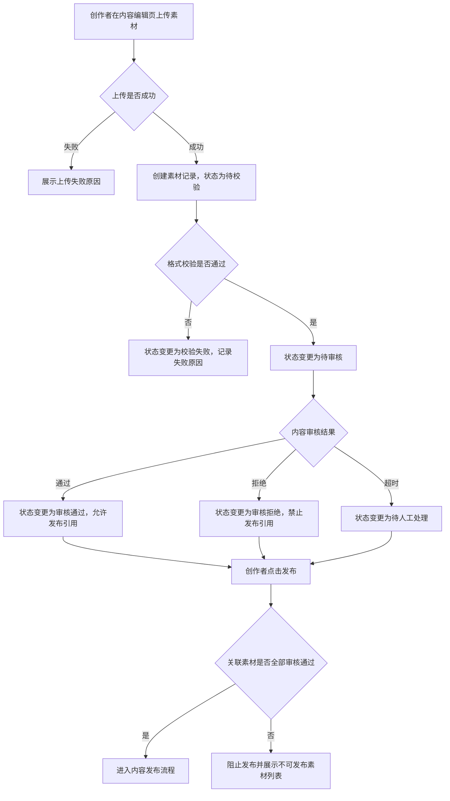

# 【PRD】内容平台-素材上传审核-创作者发布前质检

# 版本状态及修订记录

| 版本号 | 修订日期 | 修订人 | 修订阶段 | 修订内容 |
|---|---|---|---|---|
| V1.0 | 2026-06-05 | Product Team | 初始创建文档 | 新增素材上传、格式校验、内容审核、审核结果通知、发布前拦截和审核记录查询方案。 |

# 需求概览

无

## 1. 需求背景

创作者在内容平台发布图文内容前，需要上传封面图、正文配图和附件素材。当前素材上传后缺少统一的格式校验和发布前审核机制，导致部分违规、损坏或规格不符合要求的素材进入发布流程，增加运营审核和用户投诉成本。

## 2. 业务场景

创作者在 Web 工作台创建内容草稿，上传图片或附件素材。系统需在素材进入发布流程前完成格式校验和内容审核，并根据审核结果决定是否允许发布。

## 3. 商业策略

未提供

## 4. 运营数据

需记录素材上传量、校验失败量、审核通过量、审核拒绝量、平均审核耗时和发布前拦截量。

## 5. 销售计划

未提供

## 6. 期望交付时间及内容

未提供

# 产品功能实现方案

## 1. 功能概述

本需求建设内容平台的素材上传审核能力，面向创作者在发布内容前上传图片和附件的场景。系统需完成素材格式校验、内容审核、审核结果通知、发布前拦截和审核记录查询，确保进入发布链路的素材符合平台要求。

## 2. 功能详情

1. 素材上传
   - 入口：创作者工作台-内容编辑页-素材上传区。
   - 功能：支持上传图片和附件素材。
   - 规则：上传后生成素材记录，状态为待校验。
   - 异常：上传失败时展示失败原因。

2. 格式校验
   - 入口：素材上传成功后自动触发。
   - 功能：校验文件类型、文件大小、图片尺寸和文件完整性。
   - 规则：校验通过后进入待审核状态；校验失败后进入校验失败状态。
   - 异常：校验失败需返回具体失败原因。

3. 内容审核
   - 入口：格式校验通过后自动触发。
   - 功能：对素材进行内容安全审核。
   - 规则：审核通过后素材可用于发布；审核拒绝后素材不可用于发布。
   - 异常：审核超时进入待人工处理状态。

4. 发布前拦截
   - 入口：创作者点击发布按钮。
   - 功能：校验当前内容关联素材是否全部审核通过。
   - 规则：存在未通过或未完成审核素材时阻止发布。
   - 异常：展示不可发布素材列表和原因。

5. 审核记录查询
   - 入口：创作者工作台-素材详情页。
   - 功能：展示素材状态、校验结果、审核结果、失败原因和处理时间。
   - 规则：仅展示当前创作者有权限查看的素材记录。
   - 异常：素材已删除时展示无数据。

## 3. 业务限制说明

- 仅支持创作者工作台上传的素材，不覆盖开放 API 上传场景。
- 内容审核结果依赖审核服务返回，审核服务不可用时进入待人工处理状态。
- 发布前仅校验当前内容关联素材，不校验历史已发布内容。

## 4. 不支持功能说明

- 不支持创作者自行覆盖审核结果。
- 不支持批量申诉审核结果。
- 不支持对已发布内容自动下架。
- 不支持跨账号查看审核记录。

## 5. 系统/操作流程

## 6. 名称解释

| 名称 | 解释 |
|---|---|
| 素材 | 创作者上传并用于内容发布的图片或附件文件。 |
| 格式校验 | 对文件类型、大小、尺寸和完整性的系统校验。 |
| 内容审核 | 对素材内容安全性和平台规则符合性的审核。 |
| 发布前拦截 | 在创作者点击发布时，根据素材审核状态阻止不合规内容进入发布流程。 |

## 7. 关联系统及团队

| 系统/团队 | 关系说明 |
|---|---|
| 创作者工作台 | 提供素材上传、素材详情和发布入口。 |
| 素材服务 | 保存素材文件信息、状态和审核记录。 |
| 审核服务 | 返回内容审核结果。 |
| 内容发布服务 | 在发布前调用素材状态校验能力。 |

# 商业策略和运营数据实现方案

## 1. 商业策略实现方案

未提供

## 2. 产品运营数据实现方案

- 素材上传量：统计成功创建素材记录的数量。
- 校验失败量：统计状态为校验失败的素材数量。
- 审核通过量：统计状态为审核通过的素材数量。
- 审核拒绝量：统计状态为审核拒绝的素材数量。
- 平均审核耗时：统计素材进入待审核到获得审核结果的平均时长。
- 发布前拦截量：统计因素材未全部审核通过而阻止发布的次数。

# 产品功能详细设计

## 1. 素材上传

### 1.1 上传入口

- 页面：创作者工作台-内容编辑页。
- 操作：用户点击上传按钮或拖拽文件到素材上传区。
- 结果：系统开始上传文件。
- 异常：网络异常或文件读取失败时展示上传失败原因。

### 1.2 素材字段

| 字段 | 说明 | 必填 | 规则 |
|---|---|---|---|
| material_id | 素材 ID | 是 | 系统生成，唯一 |
| file_name | 文件名 | 是 | 保留原文件名 |
| file_type | 文件类型 | 是 | 根据文件 MIME 或扩展名识别 |
| file_size | 文件大小 | 是 | 单位为 byte |
| status | 素材状态 | 是 | 默认待校验 |
| creator_id | 创作者 ID | 是 | 用于权限隔离 |
| created_at | 创建时间 | 是 | 系统生成 |
| updated_at | 更新时间 | 是 | 系统更新 |

## 2. 格式校验

### 2.1 校验规则

- 文件类型需在平台支持范围内。
- 文件大小需小于平台限制。
- 图片素材需能读取宽高。
- 文件不可为空或损坏。

### 2.2 校验结果

- 校验通过：状态变更为待审核。
- 校验失败：状态变更为校验失败，并记录失败原因。

## 3. 内容审核

### 3.1 审核触发

- 触发时机：格式校验通过后。
- 触发方式：系统自动调用审核服务。
- 入参：素材 ID、素材访问地址、文件类型、创作者 ID。

### 3.2 审核状态

| 状态 | 说明 |
|---|---|
| 待审核 | 等待审核服务处理 |
| 审核通过 | 素材可用于发布 |
| 审核拒绝 | 素材不可用于发布 |
| 待人工处理 | 审核服务超时或异常后进入人工处理 |

## 4. 发布前拦截

### 4.1 发布校验

- 触发：创作者点击发布按钮。
- 条件：内容草稿关联一个或多个素材。
- 规则：全部素材状态为审核通过时允许发布；存在其他状态时阻止发布。
- 结果：阻止发布时展示素材文件名、当前状态和不可发布原因。

## 5. 审核记录查询

### 5.1 查询入口

- 页面：素材详情页。
- 权限：仅素材所属创作者可查看。
- 展示：素材基础信息、格式校验结果、内容审核结果、失败原因、处理时间。

## 6. 方案通用关注点

### 6.1 API兼容

- 新增素材上传接口需兼容 Web 工作台调用。
- 发布服务需在发布前调用素材状态校验接口。
- 审核服务返回字段需包含审核结果、失败原因和处理时间。

### 6.2 历史数据处理

无

### 6.3 导入导出功能

无

### 6.4 操作日志功能

需记录素材上传、格式校验结果、内容审核结果和发布前拦截操作。

### 6.5 数据报表调整

需新增素材上传量、审核通过量、审核拒绝量和发布前拦截量相关统计。

---文档以下无内容---
