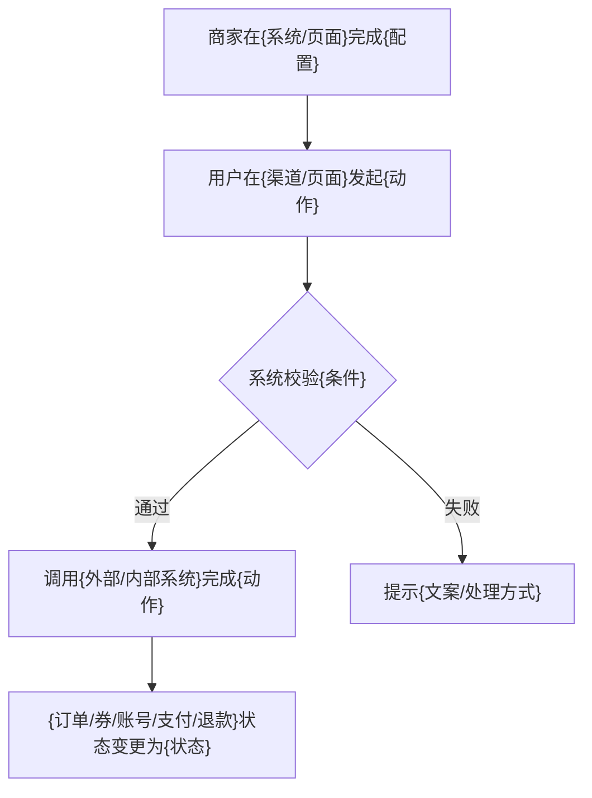

# Structured PRD Full Template

Use this template when drafting a full PRD. Keep all modules even when content is empty.
Generated PRD deliverables should be Markdown files with a `.md` suffix unless the user explicitly requests another format.

Formatting rules:
- 一级目录不编号。
- 二级目录只在所属一级目录内编号，且每个一级目录下从 `1.` 重新开始。
- 不同一级目录下的二级目录编号不顺延。
- 文档标题只保留标题本身，不单列“文档标题”模块。
- 需求概览固定输出 `无`。
- 一级目录和二级目录必须都存在，不得缺失。
- 产品功能详细设计的二级目录必须依据实际方案定义。
- 产品功能详细设计必须与产品功能实现方案中的功能概述、功能详情对应，目录顺序与功能详情保持一致。
- 产品功能详细设计是功能详情面向研发的展开版，不得新增与功能详情无关的方案主线或打乱顺序。
- 需求背景、业务场景、商业策略、运营数据、销售计划、期望交付时间及内容是 `需求概览` 下的二级目录。
- 名称解释、关联系统及团队是 `产品功能实现方案` 下的二级目录。
- 方案通用关注点是 `产品功能详细设计` 下的二级目录。
- 文档末尾固定输出 `---文档以下无内容---`。

## 文档标题

Format:

```text
【PRD】{产品线/平台}-{模块}-{业务场景/能力名称}
```

Acceptable variants:
- `【PRD】内容运营-活动报名-适配线下活动`
- `【PRD】财务结算-接口对接-适配新结算服务`
- `【PRD】交易平台-担保支付-支持先囤后用`
- `【PRD】品牌项目-SOW一阶段-核心功能交付`

Title rules:
- Include module and business scenario.
- Do not use only the project nickname.
- Keep English abbreviations such as PRD, SOW, CRM, API uppercase.
- If the source title has a specific brand, channel, or project phase, preserve it.

## 2. 版本状态及修订记录

Required table fields:

| 版本号 | 修订日期 | 修订人 | 修订阶段 | 修订内容 |
|---|---|---|---|---|
| V1.0 | YYYY-MM-DD | 姓名 | 初始创建文档 | 具体写新增了哪些方案、范围、流程或字段 |

Revision content standards:
- Good: `增加多个组织限额规则配置，去除限额记录和超限手动预约报名流程`
- Good: `付款配置和接口交互入参增加企业ID，适配单企业多店铺场景`
- Bad: `更新文档`
- Bad: `优化内容`

When writing a new version:
- V1.0 usually means initial PRD creation.
- V1.1+ must describe concrete changed sections.
- If multiple teams revised the document, preserve all revisers.

## 需求概览

固定输出 `无`。

Then include:

```text
## 1. 需求背景
## 2. 业务场景
## 3. 商业策略
## 4. 运营数据
## 5. 销售计划
## 6. 期望交付时间及内容
```

## 4. 需求背景

Write:
- policy/background trigger
- business pain point
- customer/project request
- current system gap
- why the requirement must be done now

Keep background separate from solution.

Good pattern:

```text
因{政策/平台规则/客户项目/业务计划}变化，现有{系统/流程/能力}无法满足{对象}在{场景}下的{业务目标}。为保障{业务连续性/交易闭环/客户项目交付}，需完成{能力}建设。
```

If source text exists, prefer copying it.

## 5. 业务场景

Describe where the requirement happens:
- B端/C端/商家/消费者/导购/微客/总部/门店
- channel: 微信小程序、小红书、云闪付、商城、CRM, etc.
- business action: 下单、支付、退款、核销、领券、报名、配置、同步
- boundary: specific goods, nodes, regions, payment modes, store types

If the source says `见BRD`, use `见BRD`.
If no scene is provided, use `未提供`.

## 6. 商业策略

Capture:
- product attribute, paid/free attribute
- selling version and channels
- add-on feature controls
- expiration behavior
- pricing or packaging
- target customers or pilot plan

Do not mix implementation details unless they affect commercial enablement.

Empty handling:
- Business strategy intentionally none: `无`
- Not supplied in source: `未提供`

## 7. 运营数据

Capture:
- success metrics
- expected order/customer volume
- dashboard requirements
- report/export/data-analysis requirements
- data update frequency if provided

If the source says `见BRD`, keep it.

## 8. 销售计划

Capture:
- pilot customers
- rollout scope
- sales channel
- expected delivery date for sales commitment
- paid customer list or business opportunity list

Use `无` or `未提供` when empty.

## 9. 期望交付时间及内容

Capture:
- overall launch time
- phase 1 / phase 2 delivery
- pilot timeline
- exact capabilities per delivery phase

Write dates precisely.
If source says `见SOW文档` or `见BRD`, preserve it.

## 产品功能实现方案

This is the executive product solution.

Required subsections:

```text
1. 功能概述
2. 功能详情
3. 业务限制说明
4. 不支持功能说明
5. 系统/操作流程
```

### 10.1 功能概述

Write one paragraph.

The paragraph should answer:
- what capability is being built
- who uses it
- in what scenario
- what business loop it closes
- what major modules/channels are involved

Avoid bullet lists here unless the source is extremely complex.

### 10.2 功能详情

Write as a module list that mirrors detailed design.

For every item, include:
- module or page
- entry/path
- trigger/action
- rule/condition
- output/result
- exception or prompt if provided

Example structure:

```text
1. {模块/页面}
   - 入口：{路径}
   - 功能：{功能}
   - 规则：{校验/限制/计算/状态}
   - 异常：{提示/拦截/降级}
```

### 10.3 业务限制说明

Only write scoped limitations.

Common categories:
- external platform rule limits
- supported goods/category limits
- supported payment/settlement modes
- supported organization node types
- regional or city dependency
- configuration prerequisites
- external application/manual steps outside the core system

### 10.4 不支持功能说明

Only list unsupported closed-loop features.

Common categories:
- not supporting partial refund
- not supporting page decoration
- not supporting aggregate reports
- not supporting some goods types
- not supporting some order types
- not supporting a mobile/PC entry
- not supporting operation logs in a specific place

If none, write `无`.

### 10.5 系统/操作流程

Use for complex flows. This section must contain Mermaid flowchart code blocks only.

Include actor, system, state/action, next result, and failure handling in the diagram nodes and edges.
Do not add prose or numbered steps before or after the diagram.
If no system/process flow is needed, write `无`.

Flow writing pattern:



### 6. 名称解释

Include terms that reviewers may misunderstand:
- external system abbreviation
- payment type
- channel name
- business noun
- status noun

If none: `无`.

### 7. 关联系统及团队

Recommended table:

| 产品模块 | 产品功能 | 产品经理 | 相关系统/团队 | 备注 |
|---|---|---|---|---|
| {模块} | {功能} | {姓名} | {系统/团队} | {关键词/依赖} |

If only module and PM are known, still keep the table with missing fields as `未提供`.

## 商业策略和运营数据实现方案

Use this after the related systems/team section.

Required subsections:

```text
1. 商业策略实现方案
2. 产品运营数据实现方案
```

If the commercial strategy has already been described in the front matter, this section explains implementation:
- add-on feature control
- product/package IDs
- enable/disable rules
- expiration behavior
- paid/free feature boundaries
- operational data board/report plan

If none, keep the subsection and write `无`.

## 产品功能详细设计

This section should be written after the functional overview.

For each design node, include relevant dimensions:
- page/path
- permission/visibility
- input field
- validation
- default value
- edit/delete/copy behavior
- status transition
- prompt copy
- export/import
- historical data handling
- operation log
- API compatibility
- downstream system effect

Suggested detail block:

```text
### {序号} {模块}-{页面/能力}

#### 入口
{路径/角色/权限}

#### 功能说明
{功能说明}

#### 字段/配置
| 字段 | 类型 | 是否必填 | 默认值 | 规则 | 备注 |

#### 交互逻辑
1. {动作}
2. {校验}
3. {结果}

#### 异常/提示
- {条件}：提示`{文案}`

#### 数据/状态
- {状态/字段/同步规则}
```

## 2. 方案通用关注点

Always evaluate whether these subsections are needed. If not, keep them and fill correctly.

```text
API兼容
历史数据处理
导入导出功能
操作日志功能
数据报表调整
历史参考资料
```

Common handling:
- API兼容: affected APIs, compatible fields, old data response, fallback.
- 历史数据处理: migration, default values, existing merchant behavior, old orders.
- 导入导出功能: new columns, empty historical fields, export permissions.
- 操作日志功能: whether configuration changes need logs, and where viewed.
- 数据报表调整: financial/order/customer/reporting additions.
- 历史参考资料: links or docs used for design.
