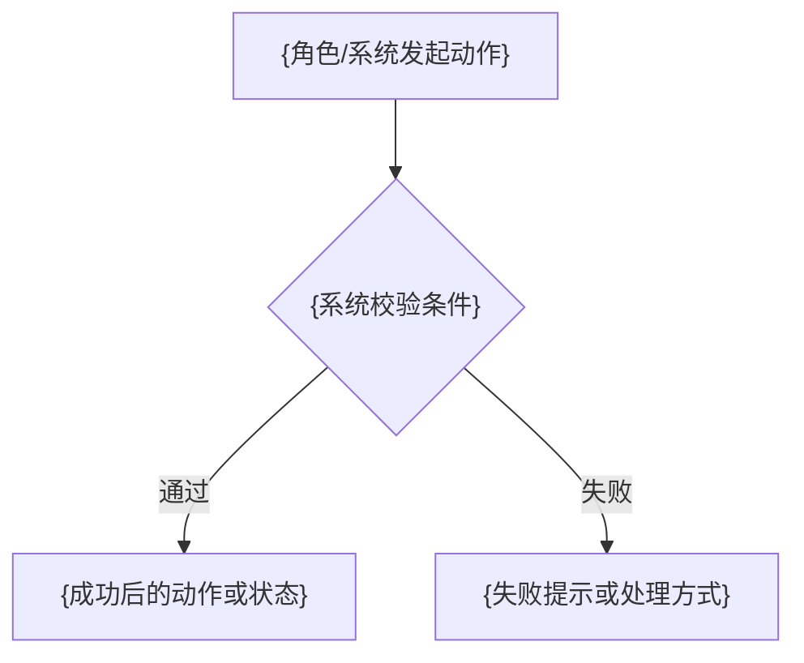

# 【PRD】{产品线/平台}-{模块}-{业务场景/能力名称}

# 版本状态及修订记录

| 版本号 | 修订日期 | 修订人 | 修订阶段 | 修订内容 |
|---|---|---|---|---|
| V1.0 | YYYY-MM-DD | {修订人} | 初始创建文档 | {具体说明本次新增的方案、范围、流程、字段或规则} |

# 需求概览

无

## 1. 需求背景

{说明需求产生的背景、业务痛点、政策/平台规则变化、客户项目要求、当前系统缺口等。若未提供，写“未提供”。}

## 2. 业务场景

{说明用户角色、使用渠道、业务动作、发生节点和业务边界。若未提供，写“未提供”。}

## 3. 商业策略

{说明收费/免费属性、销售版本、开关控制、试点范围、目标客户、定价包装等。若无，写“无”；若来源未提供，写“未提供”。}

## 4. 运营数据

{说明需要统计的指标、报表、导出、数据看板、数据更新频率等。若无，写“无”；若来源未提供，写“未提供”。}

## 5. 销售计划

{说明试点客户、销售渠道、推广范围、商机列表、销售承诺时间等。若无，写“无”；若来源未提供，写“未提供”。}

## 6. 期望交付时间及内容

{说明上线时间、分阶段交付内容、试点时间、每阶段交付能力。若来源未提供，写“未提供”。}

# 产品功能实现方案

## 1. 功能概述

{用一个段落说明要建设什么能力、谁使用、在哪个场景使用、闭合什么业务链路、涉及哪些主要模块或系统。}

## 2. 功能详情

1. {模块/页面/能力名称}
   - 入口：{路径或入口}
   - 功能：{功能说明}
   - 规则：{校验、限制、计算、状态、权限等规则}
   - 异常：{提示、拦截、降级或异常处理}

2. {模块/页面/能力名称}
   - 入口：{路径或入口}
   - 功能：{功能说明}
   - 规则：{校验、限制、计算、状态、权限等规则}
   - 异常：{提示、拦截、降级或异常处理}

## 3. 业务限制说明

- {仅写当前业务场景内的范围限制、配置前置条件、外部系统依赖、支持边界等。若无，写“无”。}

## 4. 不支持功能说明

- {仅写闭环内明确不支持的能力。若无，写“无”。}

## 5. 系统/操作流程

## 6. 名称解释

| 名称 | 解释 |
|---|---|
| {术语} | {术语解释} |

## 7. 关联系统及团队

| 系统/团队 | 关系说明 |
|---|---|
| {系统/团队名称} | {说明该系统或团队在需求中的职责和依赖关系} |

# 商业策略和运营数据实现方案

## 1. 商业策略实现方案

{说明商业策略如何在产品中落地，例如版本控制、开关、试点、权益、套餐、价格、到期处理等。若无，写“无”；若来源未提供，写“未提供”。}

## 2. 产品运营数据实现方案

{说明需要埋点、统计、报表、导出或看板展示的数据口径。若无，写“无”；若来源未提供，写“未提供”。}

# 产品功能详细设计

## 1. {实际方案目录一}

### 1.1 {子功能/页面/接口/规则名称}

- 入口：{用户从哪里进入}
- 触发：{用户动作或系统事件}
- 条件：{前置条件、权限、状态、配置}
- 结果：{成功后的数据变化、状态变化、页面变化}
- 异常：{失败、超时、重复、权限不足、外部系统异常等处理}

### 1.2 字段说明

| 字段 | 说明 | 必填 | 规则 |
|---|---|---|---|
| {field_name} | {字段说明} | 是/否 | {校验、默认值、取值范围、状态影响} |

## 2. {实际方案目录二}

### 2.1 {子功能/页面/接口/规则名称}

- 入口：{用户从哪里进入}
- 触发：{用户动作或系统事件}
- 条件：{前置条件、权限、状态、配置}
- 结果：{成功后的数据变化、状态变化、页面变化}
- 异常：{失败、超时、重复、权限不足、外部系统异常等处理}

## 3. 方案通用关注点

### 3.1 API兼容

{说明接口兼容、入参/出参变化、调用方影响、老版本兼容策略。若无，写“无”。}

### 3.2 历史数据处理

{说明历史数据是否迁移、补数据、默认值、状态初始化、老数据展示。若无，写“无”。}

### 3.3 导入导出功能

{说明是否涉及导入、导出、模板、字段、权限、失败记录。若无，写“无”。}

### 3.4 操作日志功能

{说明是否记录操作日志、记录对象、操作类型、前后值、操作人和时间。若无，写“无”。}

### 3.5 数据报表调整

{说明是否影响报表字段、统计口径、数据看板、导出列。若无，写“无”。}

---文档以下无内容---
